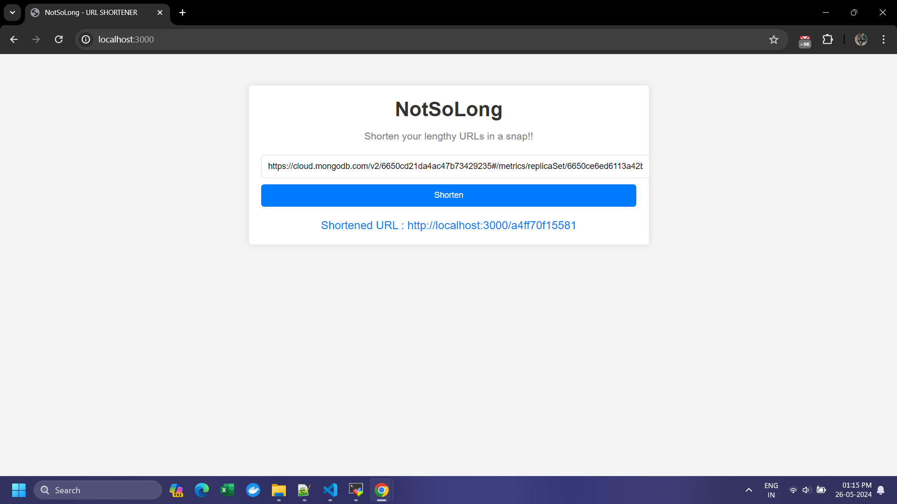
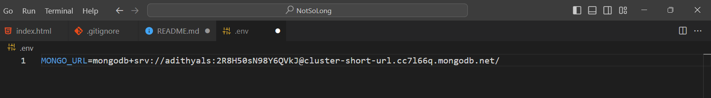
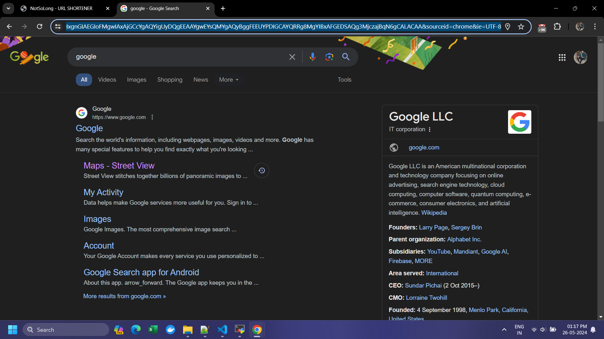
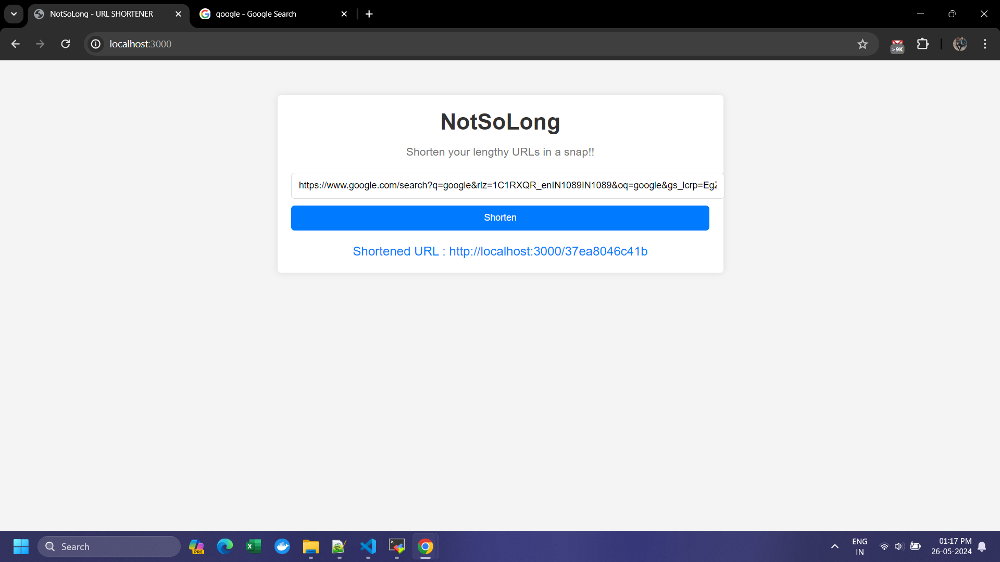
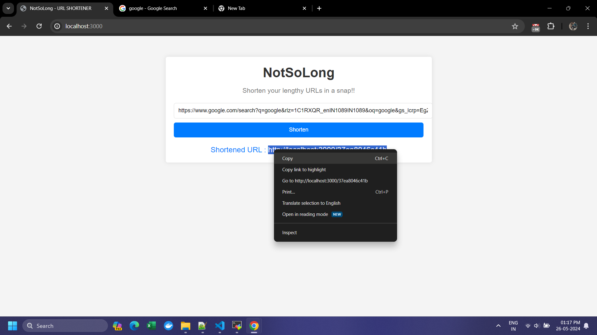
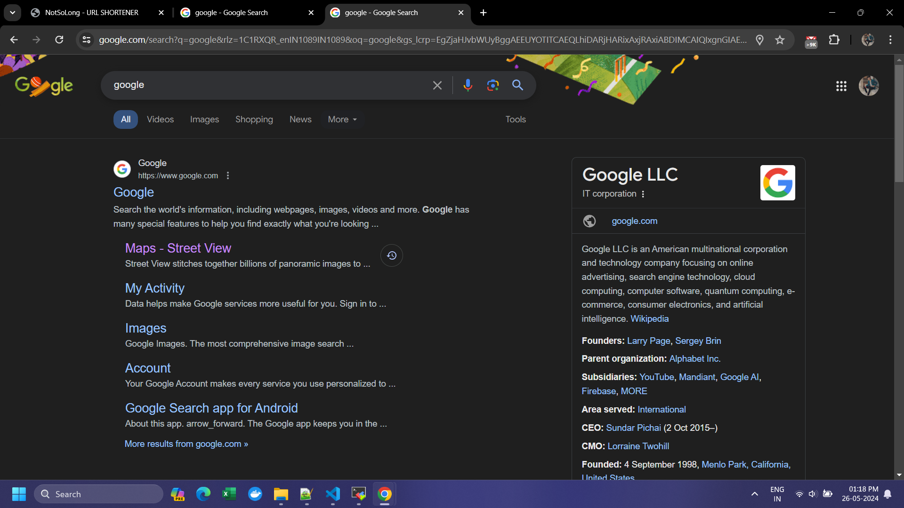
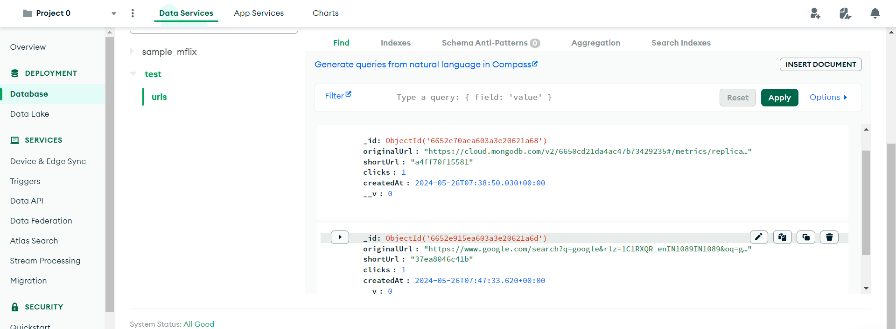

# NotSoLong

## Description
NotSoLong is a URL shortening service similar to Bitly. This application allows users to shorten long URLs into smaller, more manageable ones. It is built using Node.js, JavaScript, HTML, CSS, and MongoDB.




## Installation

1. **Install dependencies**:
    ```bash
    npm install
    ```


    ```bash
    npm install mongoose 

    npm install express 
    
    npm install body-parser

    npm install nodemon
    ```
    

## Technologies Used
- **Node.js**: JavaScript runtime built on Chrome's V8 JavaScript engine.
- **Express**: Web framework for Node.js.
- **MongoDB**: NoSQL database for storing URL mappings.
- **Mongoose**: ODM for MongoDB and Node.js.
- **Body-parser**: Node.js body parsing middleware.
- **Dotenv**: Module for loading environment variables from a `.env` file.
- **HTML/CSS**: For structuring and styling the frontend.    

2. **Create a `.env` file** in the root directory and add your MongoDB credentials:
    ```env
    MONGO_URI=your_mongodb_connection_string
    ```
    

3. **Start the application**:
    ```bash
    npm run dev
    ```


4. **Open your browser** and navigate to `http://localhost:3000`:
    

## Usage
1. **Enter the long URL** you want to shorten into the input field.
    

    

2. **Click the "Shorten" button**.
    

    

3. **Copy the shortened URL** displayed for use.


4. **MongoDB database** mongodb database.



## Folder Structure
The project is organized as follows:
```
NotSoLong/
├── public/
│   ├── css/
│   │   └── styles.css
│   └── index.html
├── src/
│   ├── controllers/
│   │   └── urlController.js
│   ├── models/
│   │   └── Url.js
│   ├── routes/
│   │   └── urlRoutes.js
│   ├── db.js
│   └── server.js
├── .env
├── package.json
└── README.md
```


## Contributing
Contributions are welcome! Please follow these steps to contribute:
1. Fork the repository.
2. Create a new branch (`git checkout -b feature-name`).
3. Make your changes.
4. Commit your changes (`git commit -m 'Add feature'`).
5. Push to the branch (`git push origin feature-name`).
6. Open a pull request.


